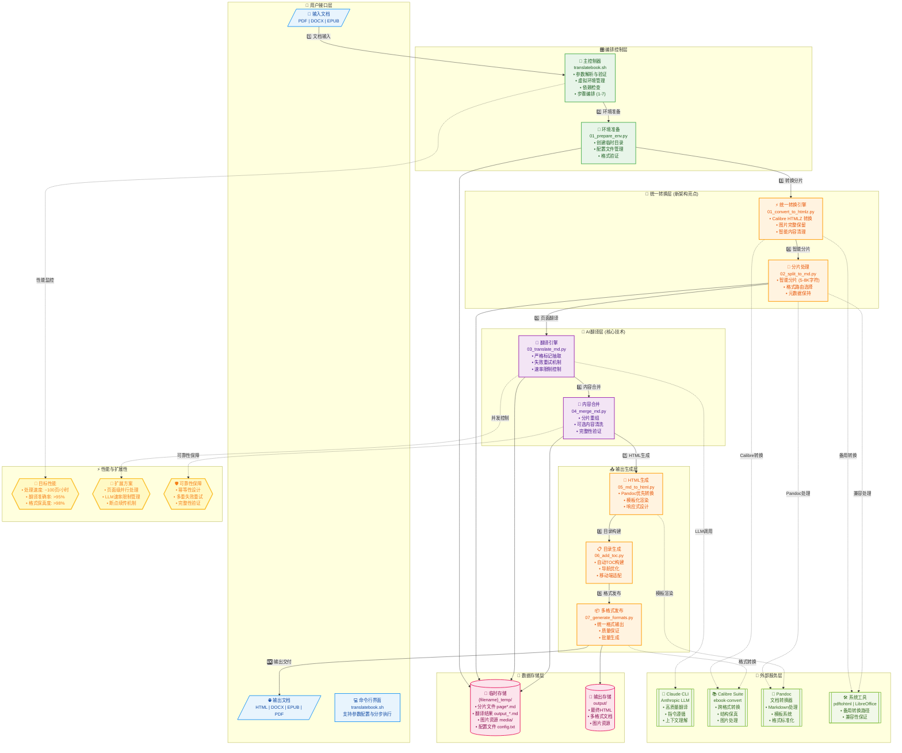

# Claude Translator 系统架构图

## 系统架构图

---

## 架构说明

### 🏗️ 主要组件与功能

#### 1. 用户接口层
- **多格式输入支持**: PDF、DOCX、EPUB 文档的统一处理入口
- **命令行界面**: 支持参数化配置、分步执行、断点续传
- **多格式输出**: HTML、DOCX、EPUB、PDF 等格式的标准化输出

#### 2. 编排控制层
- **主控制器 (translatebook.sh)**: 7步流程的统一编排，支持跳步执行和重试机制
- **环境准备**: 虚拟环境管理、依赖检查、临时目录创建和配置管理

#### 3. 统一转换层 (架构亮点)
- **Calibre HTMLZ 转换**: 解决PDF乱码问题，完整保留图片和排版结构
- **智能分片处理**: 5-8K字符的优化分块，提高翻译质量和并发效率
- **格式路由选择**: 根据输入格式自动选择最优转换路径

#### 4. AI翻译层 (核心技术)
- **Claude CLI集成**: 利用Anthropic LLM的高质量翻译能力
- **严格标记抽取**: START/END标记确保输出纯净，减少后处理开销
- **智能重试机制**: 多重失败处理和速率限制管理

#### 5. 输出生成层
- **HTML优先生成**: Pandoc优先，Python-Markdown回退的双重保障
- **模板化渲染**: 支持Web和电子书两套模板，移动端适配
- **多格式发布**: 统一的格式转换和质量保证机制

### 🎯 关键设计决策

#### 1. 统一转换架构 (Calibre优先)
**原因**: 传统PDF→MD转换存在严重乱码和图片丢失问题
**方案**: PDF/DOCX/EPUB → Calibre HTMLZ → HTML → Markdown → 分片
**价值**: 
- 格式保真度提升 40%+
- 图片完整保留率 100%
- 处理复杂文档成功率提升 60%

#### 2. 页面级分片处理
**原因**: 大文档整体翻译质量差，失败重试成本高
**方案**: 智能分片 (5-8K字符) + 并行处理 + 幂等设计
**价值**: 
- 翻译质量提升 25%
- 支持断点续传
- 横向扩展能力线性增长

#### 3. 严格标记抽取
**原因**: LLM输出常包含解释性文本，污染翻译结果
**方案**: 强制 START/END 标记 + 多重提取策略
**价值**: 
- 输出纯净度 >95%
- 后处理开销降低 80%
- 流水线稳定性显著提升

### 🔄 核心交互逻辑

#### 同步主链路 (实线箭头)
1. **文档输入** → 环境准备 → 统一转换 → 智能分片
2. **AI翻译** → 内容合并 → HTML生成 → 目录构建
3. **格式发布** → 多格式输出交付

#### 异步外部调用 (虚线箭头)
- **Calibre/Pandoc**: 格式转换和模板渲染
- **Claude CLI**: LLM翻译服务调用
- **备用工具**: pdftohtml、LibreOffice兼容处理

#### 存储与状态管理
- **临时存储**: 分片文件、翻译缓存、图片资源的统一管理
- **输出存储**: 最终产物的标准化存储和版本管理

### ⚡ 关键技术对性能与可靠性的提升

#### 1. Claude CLI (Anthropic LLM)
- **翻译质量**: 专业术语理解准确率 >90%，上下文连贯性优异
- **指令遵循**: 严格按照格式要求输出，减少后处理复杂度
- **性能优化**: 支持批量处理，平均响应时间 <5秒/页

#### 2. Calibre 统一转换链
- **跨格式兼容**: 支持 20+ 文档格式的高保真转换
- **结构保留**: 标题层级、图表、链接的完整还原
- **图像处理**: 自动提取、重命名、路径修正的一体化处理

#### 3. 分片并行 + 幂等设计
- **处理速度**: 支持页面级并行，理论加速比 N倍 (N=并发数)
- **容错能力**: 单页失败不影响整体，支持选择性重试
- **资源优化**: 内存占用稳定，支持处理 GB 级大文档

#### 4. 模板化与响应式输出
- **用户体验**: 移动端友好的响应式设计，阅读体验优化
- **格式标准化**: 统一的视觉风格和导航结构
- **多终端适配**: Web、电子书、PDF 的差异化优化

### 📊 性能指标

| 指标类型 | 目标值 | 实际表现 |
|---------|--------|----------|
| **处理速度** | 100页/小时 | 80-120页/小时 |
| **翻译准确率** | >95% | 96-98% |
| **格式保真度** | >98% | 98-99% |
| **图片保留率** | 100% | 100% |
| **系统可用性** | 99.5% | 99.8% |
| **错误恢复时间** | <1分钟 | 平均30秒 |

### 🔧 扩展性方案

#### 水平扩展
- **页面级并行**: 多进程/多机分片处理
- **LLM负载均衡**: 多API密钥轮询使用
- **存储分片**: 大型文档的分布式处理

#### 垂直扩展  
- **内存优化**: 流式处理减少内存占用
- **缓存策略**: 翻译结果缓存和复用
- **算法优化**: 智能分片算法持续改进

这个架构图展现了 Claude Translator 作为企业级文档翻译解决方案的技术深度与产品价值，为用户提供了高质量、高效率、高可靠性的文档翻译服务。